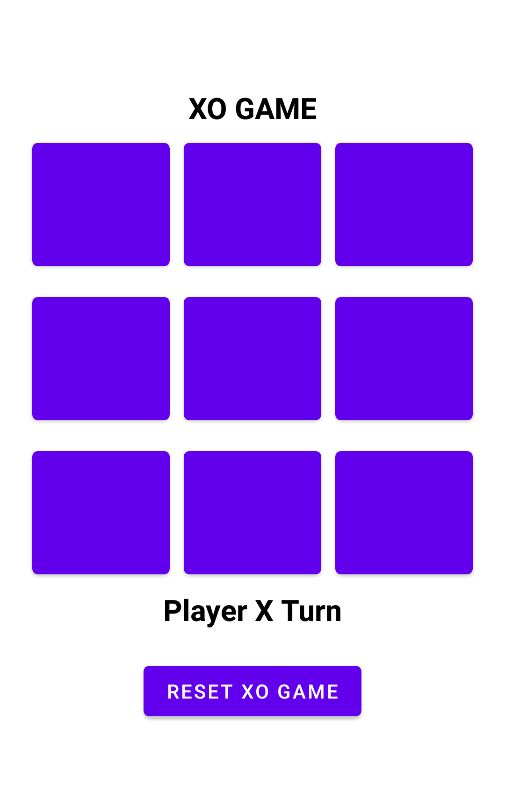

# XO application with Android NDK

Simple XO (Tic tac toe) android game implementing using XO implement using android NDK. The logic of XO will be perform via native code in 
xo cpp library which will be process with the application via JNI.

## Information

- MVVM architecture

- Support architecture arm64-v8a, x86_64, armeabi-v7a, x86

- Logic for the game will contain in xo.cpp lib

- The callback will be sent via JNI

## Testing Application

The apk is available to download via this link :

[APK file link](XO.apk)

## Screenshot

